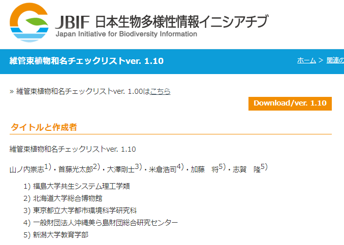
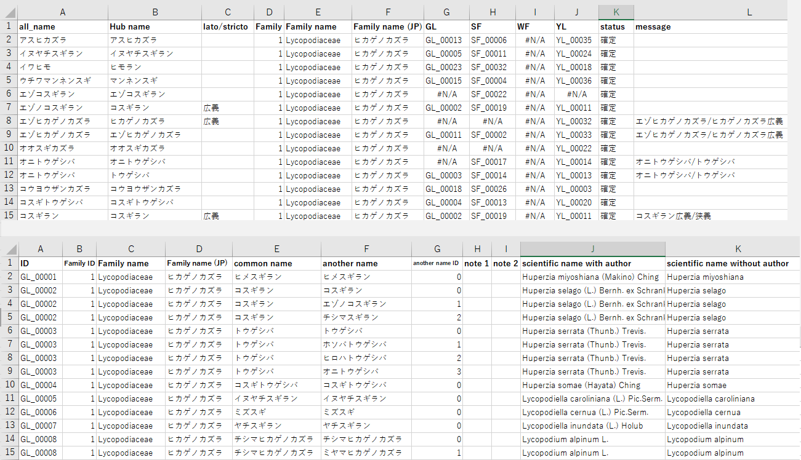
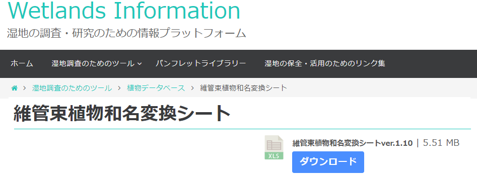
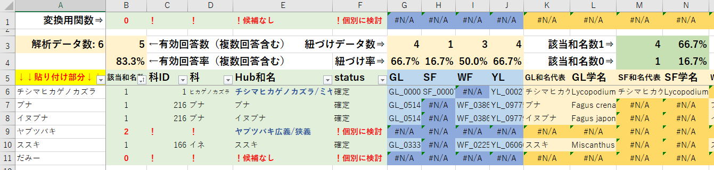
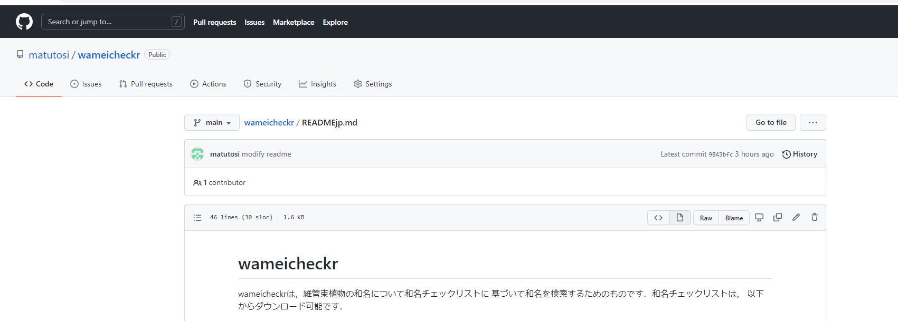
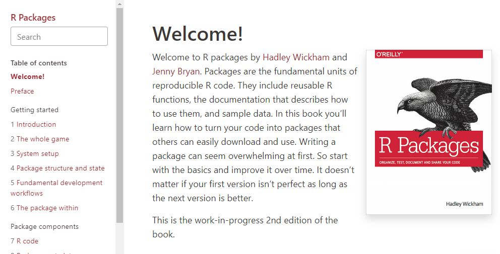

```{r setup, include=FALSE}
knitr::opts_chunk$set(echo = TRUE)
setwd("D:/Dropbox/ToDo/wameicheckr/2203ESJ")
library(tidyverse)
library(wameicheckr)
```

\center

\fontsize{34pt}{34pt}\selectfont
\vspace{20pt}
維管束植物和名チェックリストを  
Rで利用するパッケージwameicheckr   
(改訂版)

\vspace{15pt}
\fontsize{22pt}{22pt}\selectfont
松村俊和(甲南女子大)   

\vspace{20pt}

- 和名・学名の問題   
- よく使われる文献   
  -- 情報源：Ylist，日本の野生植物，...  
- 維管束植物和名チェックリスト，変換シート   
- 解析手順の問題  
- wameicheckr   
  -- 特徴，使用方法，注意点・お願い
- 類似和名・学名検索(新機能)   
- その他   
  -- インストール方法，参考文献


\newpage
\fontsize{32pt}{32pt}\selectfont

\begin{center}
和名・学名の問題
\end{center}

- どの文献に従うか?  
- 学名表記の揺れ：結構ややこしい  
- そもそもの分類の問題もある  

\begin{center}
\downarrow   
\end{center}

\begin{center}
実際には
\end{center}

- よく使われているもの   
- 便利なもの   


\newpage

\fontsize{32pt}{32pt}\selectfont

\begin{center}
植生学会誌   

\fontsize{22pt}{22pt}\selectfont
vol.35以降の論文での和名・学名   

\end{center}

\fontsize{28pt}{28pt}\selectfont
\vspace{20pt}
|和名・学名の根拠  |論文数      |うちRを使用   |
|:----------------:|:----------:|:------------:|
|Ylist             | 17         | 9            |
|日本の野生植物    |  3         | 0            |
|Green List        |  1         | 1            |
|その他            |  2         | 1            |
|記載なし          | 10         | 5            |
|計                | 33         | 16           |

\newpage

\fontsize{32pt}{32pt}\selectfont

\begin{center}
よく使われる文献
\end{center}

- ネットで入手可    
  -- Ylist(YL)   
  -- GreenList(GL)   
- 手入力?   
  -- 日本の野生植物(WF)   

\begin{center}
\downarrow   
\end{center}

全てを含むものがあれば，Good

\newpage

\fontsize{32pt}{32pt}\selectfont

\begin{center}
維管束植物和名チェックリスト
\end{center}

- GBIFで公開されている   
- YL, WF, GLを収録   
- 労力・時間をかけて整理(たぶん)   
- 分類の未統合のものがある(仕方ない)   
- 学名の問題もある(仕方ない)   

\begin{center}
\downarrow   
\end{center}

- (個人の感想) 使い方は?    
- エクセル形式のため，手作業が必要   

\newpage

<!-- 和名チェックリストのページ -->


<!-- https://www.gbif.jp/v2/activities/wamei_checklist.html -->

\newpage

<!-- 和名チェックリストの内容 -->


\newpage

\fontsize{32pt}{32pt}\selectfont

\begin{center}
維管束植物和名変換シート
\end{center}

- 和名チェックリストを使いやすく  
- エクセル形式  
- 手作業(コピペ)が必要  
- 大量の場合は少し時間がかかる  

\newpage


<!-- 変換シートのページ -->


\vspace{20pt}

<!-- 変換シートの内容 -->



\newpage

\fontsize{32pt}{32pt}\selectfont

\begin{center}
解析手順の問題
\end{center}

- 手作業による作業の中断   
-- エクセルに入力   
-- チェック・変換(手作業)   
-- データ保存(手作業)   
-- Rで解析   

- Rでできたら便利では?   
-- エクセルに入力(ここは仕方なし)   
-- Rでチェック・変換，解析   

- Rで関数を作ってしまおう!   


\newpage

\fontsize{32pt}{32pt}\selectfont

\begin{center}
wameicheckrの特徴
\end{center}

- 和名チェックリストのデータを含む   
  -- 更新は元のデータに合わせて(予定)   
- 簡単な操作(のはず)   
- GitHubで公開   

<!-- wameicheckr：GitHub -->


\newpage

\fontsize{32pt}{32pt}\selectfont

\begin{center}
wameicheckrの使用方法
\end{center}

- インストール(省略)   
- 準備・データ整理   
- 元データのエラー修正   
- 和名の準備   
- 引数の説明   
-- 出力形式：横長 or 縦長   
-- データソース   
- 関数による違い   

\newpage

\fontsize{32pt}{32pt}\selectfont

\begin{center}
準備・データ整理
\end{center}

\fontsize{14pt}{14pt}\selectfont
```{r eval=FALSE}
library(tidyverse)
library(wameicheckr)
```

```{r}
data(hub_master)
data(jn_master)

hub_master <- 
  hub_master %>%
  tibble::as_tibble() %>%
  dplyr::rename_with(~stringr::str_replace_all(., "[ /]", "_")) %>%
  dplyr::rename_with(~stringr::str_replace_all(., "[()]", "")) %>%
  print(n=5)
```


\newpage

\fontsize{32pt}{32pt}\selectfont

\begin{center}
準備・データ整理(続き)
\end{center}

\fontsize{14pt}{14pt}\selectfont
```{r}
jn_master <- 
  jn_master %>%
  tibble::as_tibble() %>%
  dplyr::rename_with(~stringr::str_replace_all(., "[ /]", "_")) %>%
  dplyr::rename_with(~stringr::str_replace_all(., "[()]", "")) %>%
  fill_another_name_id() %>% # another_name_id の空欄を埋める
  print(n=5)
```


\newpage

\fontsize{32pt}{32pt}\selectfont

\begin{center}
和名チェックリスト ver.1.10のエラーの修正   
バージョンアップで，修正される予定   
\end{center}

\fontsize{14pt}{14pt}\selectfont
```{r}
no_id_0 <- 
  c("SF_00131", "SF_00323", "WF_01542", "WF_02219", "WF_04287", 
  "SF_00127","WF_01902","WF_03825","YL_11456","YL_17759")
jn_master$another_name_ID[
  jn_master$ID %in% no_id_0 & jn_master$another_name_ID != 0] <- 0

  # (和名チェックリスト ver.1.10への対応) シベリアカラマツ(別科同名)
hub_master$Hub_name[
  hub_master$Hub_name=="シベリアカラマツ" & hub_master$Family_name_JP=="マツ"] <- 
  "シベリアカラマツ(マツ科)"
hub_master$Hub_name[hub_master$Hub_name=="シベリアカラマツ" & 
  hub_master$Family_name_JP=="キンポウゲ"] <-  "シベリアカラマツ(キンポウゲ科)"
jn_master$Family_name_JP[jn_master$Family_name_JP=="ツルボラン"] <- 
  "ワスレグサ"
```

\newpage

\fontsize{32pt}{32pt}\selectfont

\begin{center}
x1：データ内の全和名(の一部)   
x2：和名の例   
\end{center}

\fontsize{14pt}{14pt}\selectfont
```{r}
x1 <- 
  c(hub_master$all_name, hub_master$Hub_name, 
  jn_master$common_name, jn_master$another_name) %>%
  purrr::map(str_split, "/") %>%
  unlist() %>% unique() %>% sort() %>%
  c("だみーの和名", .) %>%
  .[1:30]

x2 <- c("だみー", "ススキ", "チガヤ",  "ハリガネワラビ", "オミナエシ", 
  "カナビキソウ", "ヤイトバナ", "キジムシロ", "ハエドクソウ", "コナスビ", 
  "キツネノマゴ", "シロヨメナ", "オオフジシダ", "コマツナギ", 
  "アイヌタチツボスミレ", "シベリアカラマツ", "アオイモドキ")
```

\newpage

\fontsize{32pt}{32pt}\selectfont

\begin{center}
使用方法
\end{center}

\fontsize{22pt}{22pt}\selectfont
```{r eval=FALSE}
wamei_check(
  x,           # 検索する和名
  hub_master,  # Hubデータ
  jn_master,   # jnデータ
  wide = TRUE, # 出力形式(TRUE：横長，FALSE：縦長)
  ds = c(GL, SF, WF, YL)  # データソース
    # GL：Green List
    # SF：シダ標準図鑑
    # WF：日本の野生植物
    # YL：Ylist
  )
```


\newpage

\fontsize{32pt}{32pt}\selectfont

\begin{center}
横長(上)と縦長(下)
\end{center}

\fontsize{12pt}{12pt}\selectfont
```{r}
wamei_check(x1, hub_master, jn_master, ds=c(WF, YL)) %>% 
  select(input, !contains("Fami") & contains(c("ID", "comm"))) %>% print(n=5)
wamei_check(x1, hub_master, jn_master, ds=c(WF, YL), wide=FALSE) %>%
  select(input, source, ID, common_name) %>% print(n=7)
```

\newpage

\fontsize{32pt}{32pt}\selectfont

\begin{center}
関数による違い
\end{center}

\fontsize{12pt}{12pt}\selectfont
```{r}
wamei_check(x2, hub_master, jn_master, wide=FALSE) %>%
  dplyr::select(input, status, source, ID, common_name) %>% print(n=8)
wamei_check_ex(x2, hub_master, jn_master, wide=FALSE) %>% 
  dplyr::select(input, status, source, ID, common_name) %>% print(n=5)
```

\newpage

\fontsize{32pt}{32pt}\selectfontx

\begin{center}
類似和名・学名検索(新機能)
\end{center}

\fontsize{24pt}{24pt}\selectfont
- 文字列の編集距離   
  -- 2つの文字列の近さを示す  
  -- 挿入・置換・削除の手順の回数   
  -- 例：ハッカグサとハシカグサの距離は1(1回の置換)   
- 標準化した編集距離   
  -- 編集距離 / 長い方の文字列の文字数
- 検索用の関数   
  -- 和名：mosiya()   
  -- 学名：maybe()   

\newpage

\fontsize{32pt}{32pt}\selectfont

\begin{center}
類似和名・学名の検索
\end{center}

\fontsize{16pt}{16pt}\selectfont
```{r}
data(ref_jp)  # 和名の参照用データ
ref_jp        # 和名は文字コードの関係でエスケープ文字を使用
```

\newpage

\fontsize{32pt}{32pt}\selectfont

\begin{center}
類似和名・学名の検索
\end{center}

\fontsize{16pt}{16pt}\selectfont
```{r}
data(ref_sc)  # 学名の参照用データ
ref_sc
```

\newpage

\fontsize{32pt}{32pt}\selectfont

\begin{center}
類似和名の検索(複数入力)
\end{center}

\fontsize{14pt}{14pt}\selectfont
```{r}
  # 和名
mosiya(c("ハッカグサ", "スズノエンドウ"))
```

\newpage

\fontsize{32pt}{32pt}\selectfont

\begin{center}
類似和名の検索(複数入力)
\end{center}

\fontsize{14pt}{14pt}\selectfont
```{r}
  # 検索条件の変更が可能
  # min_dist: 編集距離
  # min_dist_norm: 標準化した編集距離
mosiya(c("ハッカグサ", "スズノエンドウ"), min_dist=2, min_dist_norm=0.1)
```

\newpage

\fontsize{32pt}{32pt}\selectfont

\begin{center}
類似学名の検索(複数入力)
\end{center}

\fontsize{14pt}{14pt}\selectfont
```{r}
maybe(c("Viola madahuricaa", "Carex nevarta"))
```

\newpage

\fontsize{32pt}{32pt}\selectfont

\begin{center}
注意点・お願い
\end{center}

- Windows, Mac, Ubuntu で動くはず   
- 和名チェックリストが更新中(修正中)   
- バグがあるかも：基本は自己責任で   
- 要望やバグ報告は歓迎   

\newpage

\fontsize{32pt}{32pt}\selectfont

\begin{center}
今後の方向性
\end{center}

\fontsize{22pt}{22pt}\selectfont
- editdist_multi()は汎用関数   
 -- maybe(), mosiya()はeditdist_multi()を使用   
 -- 少し改変すれば，他の分類群でも使用可能   
 -- 自由に改変してください   
 -- 方法不明の場合は連絡ください   
- 維管束植物以外の日本産生物の種名の一覧   
  -- http://www.ujssb.org/checklist/index.html   
  --- 類似パッケージの要望があれば連絡ください   

\newpage

\fontsize{32pt}{32pt}\selectfont

\begin{center}
インストール方法
\end{center}

\fontsize{22pt}{22pt}\selectfont
```{r eval=FALSE}
install.packages("devtools")
devtools::install_github("matutosi/wameicheckr")

devtools::install_github("matutosi/wameicheckr",   
  build_vignettes = TRUE) # pandocが必要
```

\newpage

\fontsize{32pt}{32pt}\selectfont

\begin{center}
参考文献
\end{center}

\fontsize{20pt}{20pt}\selectfont
- Hadley Wickham (2016) Rパッケージ開発入門   
  -- https://r-pkgs.org/   



<!--
\newpage

\fontsize{32pt}{32pt}\selectfont

\begin{center}
類似和名の検索(1つだけ入力)
\end{center}

\fontsize{14pt}{14pt}\selectfont
```{r}
  # 和名: search_similar_name() では len=6 が必須(文字コードの関係)
  # dist, dist_normの小さい順で出力
  # 既定値：min_dist=4未満 or min_dist_norm=0.2未満を出力
  # 対象文字列が短いと，編集距離4ではほとんど意味がない
search_similar_name("ハッカグサ", len=6)
```

\newpage

\fontsize{32pt}{32pt}\selectfont

\begin{center}
類似和名の検索(1つだけ入力)
\end{center}

\fontsize{14pt}{14pt}\selectfont
```{r}
  # 検索後にふるい分け
search_similar_name("ハッカグサ", len=6) %>%
  dplyr::filter(dist < 3 & dist_norm < 0.5)
```

\newpage

\fontsize{32pt}{32pt}\selectfont

\begin{center}
類似学名の検索(1つだけ入力)
\end{center}

\fontsize{14pt}{14pt}\selectfont
```{r}
  # dist, dist_normの小さい順で出力
search_similar_name("Viola madahuricaa", len=1) %>%
  dplyr::filter(dist < 4 & dist_norm < 0.2)
```

-->
